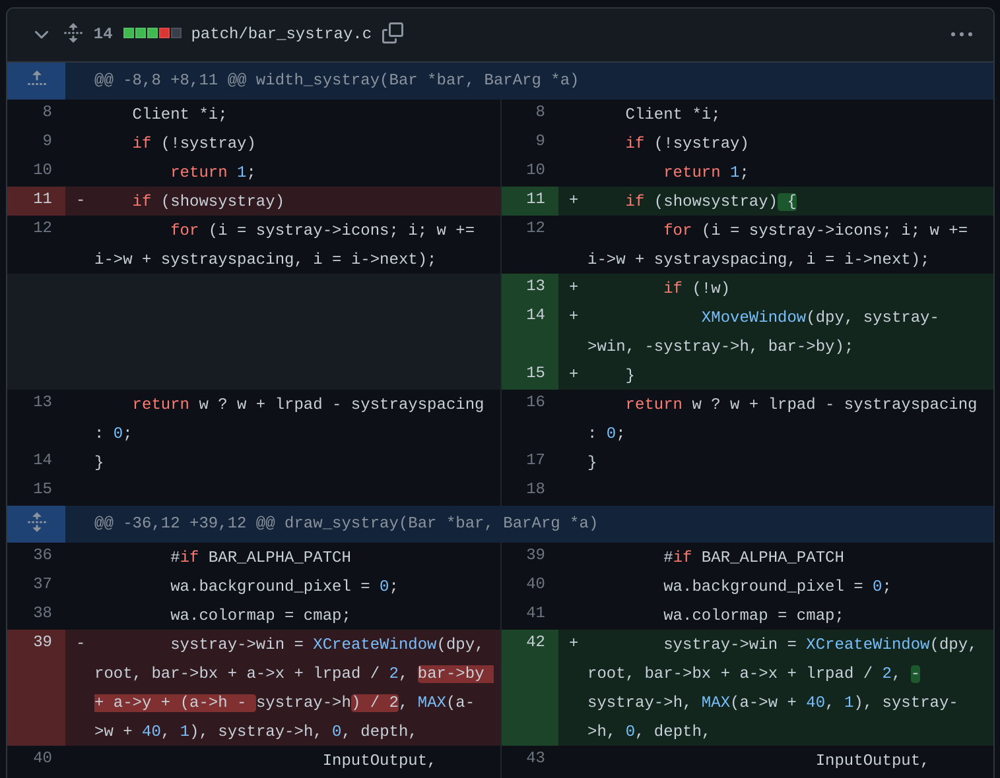
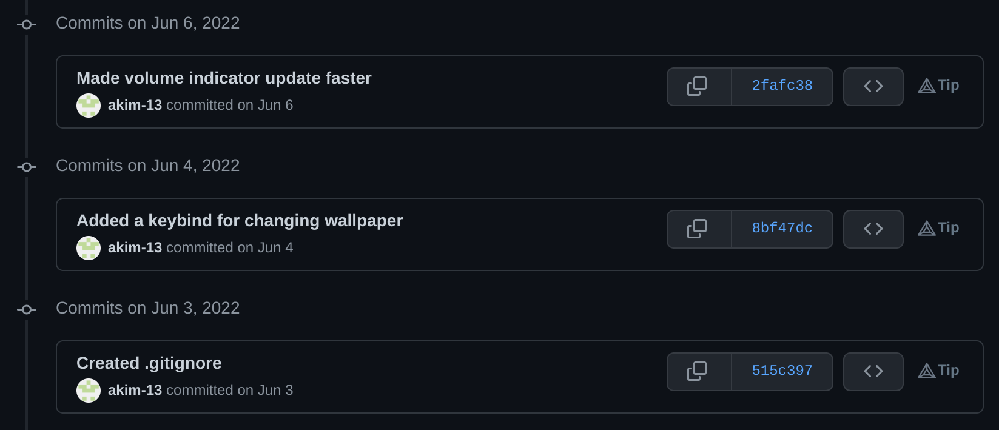
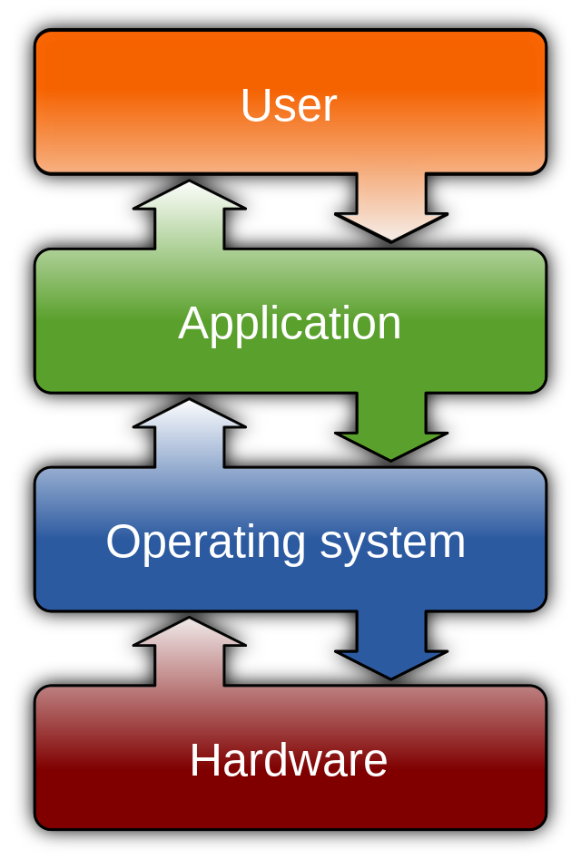
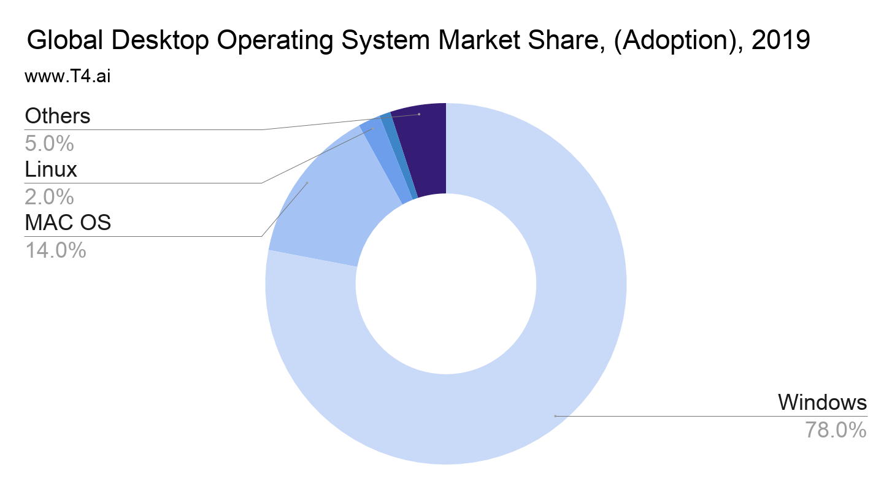

# Linux: The OS You Control

## Table of Contents
- [Abstract](#abstract)
- [Remarks](#remarks)
  * [Format](#format)
  * [Activity Logging](#activity-logging)
- [Why Linux?](#why-linux)
  * [Operating Systems](#operating-systems)
  * [Windows](#windows)
  * [Mac OS](#mac-os)
  * [Linux](#linux)
- [Which Linux?](#which-linux)
    * [Linux Distributions](#linux-distributions)
    * [Everyday *VS* Specialised Use](#everyday-vs-specialised-use)
    * [Beginner Friendly *VS* Advanced](#beginner-friendly-vs-advanced)
    * [Desktop Environment *VS* Window Manager](#desktop-environment-vs-window-manager)
    * [GUI *VS* CLI](#gui-vs-cli)
    * [Stable *VS* Rolling Release](#stable-vs-rolling-release)
- [My Linux](#my-linux)
    * [Distribution](#distribution)
    * [Core Setup](#core-setup)
        + [Security](#security)
        + [Graphical Environment](#graphical-environment)
    * [Command Line](#command-line)
        + [Shell](#shell)
        + [Text Editor](#text-editor)
    * [GUI Applications](#gui-applications)
    * [Backup System](#backup-system)
        + [Partial Backup](#partial-backup)
        + [Full System Backup](#full-system-backup)

## Abstract
*WIP*

## Remarks
### Format
The following project will be made entirely in a Markdown format. From the
official website:

> **Markdown** is a lightweight markup language that you can use to add formatting
> elements to plaintext text documents.[^md]

[^md]: https://www.markdownguide.org/getting-started/

Markdown is mostly used for simple tasks where minimal formatting is needed,
e.g. emails, technical documentations or notes. Consequently, it might be
argued that such a format is inappropriate for an extensive academic project,
such as this one. 

However, every issue that may be encountered has been carefully considered and
accounted for. Moreover, this format brings some substantial benefits over
standard solutions (PDF, DOCX, etc.) to both the author and the readers,
namely:

- **Interactivity**
    - Video demonstrations are necessary for showcasing the OS at work
    - External links make it easier to link sources of information
    - Internal links make traversing the document effortless
- **Minimalistic design**
    - Easier editing
    - Better readability
- **Accessibility**
    - This document is hosted on [GitHub](https://github.com/) where Markdown
      is neatly integrated for viewing and accessing such projects

### Activity Logging
Thorough logging of every undertaken action is both a requirement and a big
part of the project. The initial solution was to write a [custom Python
program](activity.py) called the *Activity Logger* to provide an all-in-one
[file](activity.log) with activities as plain text entries:

```
    _        _   _       _ _            _                                    
   / \   ___| |_(_)_   _(_) |_ _   _   | | ___   __ _  __ _  ___ _ __       
  / _ \ / __| __| \ \ / / | __| | | |  | |/ _ \ / _` |/ _` |/ _ \ __|   
 / ___ \ (__| |_| |\ V /| | |_| |_| |  | | (_) | (_| | (_| |  __/ |        
/_/   \_\___|\__|_| \_/ |_|\__|\__, |  |_|\___/ \__, |\__, |\___|_|
                               |___/            |___/ |___/                  
Creator: Akim                                                                
Source code: https://github.com/akim/epq
                                  
Tags:                                                                        
( A ) - Activity                                                             
( D ) - Description                                                          
( F ) - Fixed                                                                
(I__) - Issue                                                                
(W__) - Warning
                                                            
=====================================================================
      
[10-12-2021 19:12] ( A ) Downloaded the Arch Linux ISO file
[10-12-2021 19:25] ( A ) Verfied the image signature using gpg
[10-12-2021 19:33] ( A ) `dd`-ed the image to a usb drive
[10-12-2021 19:51] (I01) Cannot boot into the live environment
  [11-12-2021 18:08] ( F ) Reformatted the usb and reinstalled the iso
[11-12-2021 18:08] ( A ) Fixed I01
  [11-12-2021 18:08] ( D ) The iso might have been corrupted
[11-12-2021 18:08] ( A ) Added a description to A24
[11-12-2021 18:13] ( A ) Connected to wifi using iwctl
[11-12-2021 18:21] ( A ) Created a LUKS encrypted container
[11-12-2021 18:50] ( A ) Made and formatted the logical volumes (LVM)
[11-12-2021 19:04] ( A ) Mounted the file systems
...
```
Nevertheless, this solution has proved to be unsustainable in the long run, as
the program needed to be improved and maintained, which put a significant, but
more importantly an unnecessary, extra load.

A better solution turned out to be the use of an already existing and utilised
system — GitHub. At its core, GitHub is a website and cloud-based service for
sharing code, which incorporates a [Version Control
System](https://en.wikipedia.org/wiki/Version_control) (VCS) called
[git](https://git-scm.com/). 

This system provides an extremely detailed breakdown of every little change in
the system, right down to a side-to-side comparison of every altered line of
code *(fig. 1)*. Yet understandability remains unharmed, as all the changes can
be presented with a short description on a simple timeline *(fig. 2)*, thus
each aspect of this solution has been proven to be superior to the previous
one.

 
*<p align="center"> Figure 1 </p>*


*<p align="center"> Figure 2 </p>*

## Why Linux?
### Operating Systems
> An **Operating System (OS)** is an interface between a computer user and
> computer hardware *(fig. 3)*. It is a software which performs all the basic tasks like
> file management, memory management, process management, handling input and
> output, and controlling peripheral devices such as disk drives and
> printers.[^os-def]

[^os-def]: https://www.tutorialspoint.com/operating_system/os_overview.htm

 
*<p align="center"> Figure 3 </p>*

There are three major OSs in the current market *(fig. 4)*:
1. Windows
2. Mac OS
3. Linux

The most popular one OS by far is Windows, accounting for roughly 70% of global
market share. It is aimed to be compatible with as many devices as possible,
hence it is a go-to choice of all major PC/laptop manufacturers.

In second place is Mac OS at around 15% market share. Although it is only
available for laptops produced by Apple, with [over 20 million units sold
annually](https://www.macrumors.com/2021/01/19/mac-sales-skyrocketing-after-m1-launch/),
big market share is not a surprise.

However, Linux, being free and compatible with almost all of the devices
running Windows or Mac OS, comprises only 2-3% of the current market. To
understand why that is, a deeper understanding of each OS is needed.


 
*<p align="center"> Figure 4 </p>*

### Windows
The first version of Windows, released in 1985, was simply a GUI offered as an
extension of Microsoft’s existing disk operating system, or MS-DOS. Based in
part on licensed concepts that Apple Inc. had used for its Macintosh System
Software, Windows for the first time allowed DOS users to visually navigate a
virtual desktop, opening graphical “windows” displaying the contents of
electronic folders and files with the click of a mouse button, rather than
typing commands and directory paths at a text prompt.[^win-history]

[^win-history]: https://www.britannica.com/technology/Windows-OS

In subsequent years the functionality of the OS gradually expanded, whilst most
of the complexity behind it remained unseen by an average user. This approach
appealed to many people around the World, and soon Windows became the most
widely used desktop OS in the market. 

Nonetheless, the convenience of being pre-installed on most of the devices,
pre-configured and relatively straightforward
[GUI](https://en.wikipedia.org/wiki/Graphical_user_interface) and just the fact
of being an
[off-the-shelf](https://en.wikipedia.org/wiki/Commercial_off-the-shelf)
software, comes at a price. Both figuratively and literally.

At the time of writing, the price of the full and latest Windows version for an
individual is
[$199.99](https://www.microsoft.com/en-us/d/windows-10-pro/df77x4d43rkt/48dn?rtc=1&activetab=pivot:overviewtab).
Although it is possible to use a newly bought Windows laptop without
explicitly paying such a high price, the functionality of the OS will be
severely constrained (e.g. unable to set a custom wallpaper). Consequently, the
cost of the OS is usually paid indirectly, because it is included in the price
of a device, or directly through Microsoft store in order to activate the
product.

Furthermore, to appeal to [almost 1.5 billion
people](https://news.microsoft.com/bythenumbers/en/windowsdevices), a multitude
of immutable decisions must be made for them by the system developers, which
might not be in the best interest of the people themselves. For instance, the
general look of the GUI, the core services used or even the
[kernel](https://en.wikipedia.org/wiki/Kernel_(operating_system)). Allowing to
alter something that has been permanently set by the developers would most
likely harm the compatibility, stability and security of the system, and
increase the configuration complexity for an end-user. None of the above seem
to be beneficial for such a huge business, therefore the amount of available
customisation is substantially limited.

However, a far dangerous, albeit less noticeable in the short term, price is
one's privacy. Microsoft is known to collect hundreds upon hundreds of [data
entries](https://igotoffer.com/microsoft/what-data-does-microsoft-collect),
such as installed applications, hardware/device information, browsing, search
and query data, details about the voice and typing input features. If you ever
wondered how the internet ads match exactly the topic of conversation that you
recently had with your friend, relative or college, this is one of the reasons.
The main motivation behind collecting such sensitive personal information is
to:

> - Personalise our products and make recommendations.
> - Advertise and market to you, which includes sending promotional
>   communications, targeting advertising, and presenting you with relevant
>   offers.[^ads]

[^ads]: https://privacy.microsoft.com/en-gb/privacystatement

This also serves as a big source of system diagnostics, which is used for
development and improvement. Nonetheless, if the consumers were actually aware
that in order to use the OS every little action they take would have to be
under constant surveillance, such shady business model would have been very
unlikely to succeed on the global market.

### Mac OS

Mac OS was developed by the American computer company Apple Inc. The OS was
introduced in 1984 to run the company’s Macintosh line of personal computers.
The Macintosh heralded the era of graphical user interface (GUI)
systems, and it inspired Microsoft Corporation to develop its own GUI, the
Windows OS.

In 1996 Apple acquired rival NeXT Computers, which was founded by Steve Jobs
after his departure from Apple, and in 2001 the company rolled out Mac OS X, a
major redesign based on both the NextStep system and Apple’s most recent OS
release. OS X ran on a UNIX kernel (core software code) and offered technical
advances such as memory protection and preemptive multitasking, along with a
more versatile Finder, an elegant-looking interface called Aqua, and a
convenient graphical “Dock” bar for launching frequently used
applications.[^mac-history]

[^mac-history]: https://www.britannica.com/technology/Mac-OS

Although Mac OS may be considered open source (the kernel, [BSD
subsystems](https://infomory.com/what-is/what-is-bsd-subsystem/), [browser
rendering engine WebKit](https://webkit.org/), etc.) it has a proprietary
application programming interface ([API](https://en.wikipedia.org/wiki/API)),
which is much larger than in both Linux and Windows. Consequently, it raises
the same privacy concern as discussed in the [Windows section](#windows), i.e.
collecting personal data.

Although the software side customization is more promising on Mac OS, there is
a major disadvantage to using this operating system due to the hardware
limitations. Officially Mac OS is only available for Apple devices (MacBooks,
iMacs and such), therefore in order to use it, one must be willing to use one
of the hardware configurations provided by the company. The minimum price that
has to be paid for the OS is equivalent to the price of the [cheapest official
MacBook](https://www.apple.com/macbook-air-m1/) — $999.

### Linux

In 1969, a team of developers of Bell Labs started a project to make a common
software for all the computers and named it as "Unix". It was simple and
elegant, used "C" language instead of assembly language and its code was
recyclable. As it was recyclable, a part of its code now commonly called
"kernel" was used to develop the operating system and other functions and could
be used on different systems. Also its source code was open source. 

In 1983, Richard Stallman developed GNU project with the goal to make it freely
available Unix like operating system and to be used by everyone. But his
project failed in gaining popularity. In 1991, Linus Torvalds a student at the
university of Helsinki, Finland, thought to have a freely available academic
version of Unix started writing its own code. Later this project became the
Linux kernel. He started it just for fun but ended up with such a large
project. He published the Linux kernel under his own license and was restricted
to use it commercially. Linux uses most of its tools from GNU software and are
under GNU copyright. In 1992, he released the kernel under GNU General Public
License.[^linux-history]

[^linux-history]: https://www.javatpoint.com/linux-history

Because Linux was developed as FOSS ([Free and Open Source
Software](https://en.wikipedia.org/wiki/Free_and_open-source_software)) it
abides by the four essential freedoms of free software, defined by Richard M.
Stallman in his book "Free Software, Free Society" and later adopted by the FSF
([Free Software Foundation](https://www.fsf.org/)):

> - The freedom to run the program as you wish, for any purpose (**freedom 0**).
> - The freedom to study how the program works, and change it so it does your
>    computing as you wish (**freedom 1**). Access to the source code is a
>    precondition for this.
> - The freedom to redistribute copies so you can help others (**freedom 2**).
> - The freedom to distribute copies of your modified versions to others
>    (**freedom 3**). By doing this you can give the whole community a chance to
>    benefit from your changes. Access to the source code is a precondition for
>    this.[^four-freedoms]

[^four-freedoms]: https://www.gnu.org/philosophy/free-sw.en.html#four-freedoms

These four simple principals allow Linux to resolve major issues present in
Windows and Mac OS. Firstly, there are no privacy, surveillance or data selling
concerns with Linux, due to the first freedom. Every changed setting, ran
command or any other undertaken action can be freely traced and analyzed to
ensure that it does what it is supposed to do, instead of sending user data to
a big corporation for instance.

Secondly, Linux is free and widely available. The Kernel itself is 100% free
and open source, as are most of the
[distributions](https://en.wikipedia.org/wiki/Linux_distribution). Some of them
are paid (e.g.
[RHEL](https://www.redhat.com/en/technologies/linux-platforms/enterprise-linux)),
however with [over 600 active
distributions](https://truelist.co/blog/linux-statistics/#:~:text=Today%2C%20there%20are%20over%20600%20active%20Linux%20distros.,-Another%20500%20are&text=Some%20of%20the%20most%20commonly,Linux%20distribution%20usage%20statistics%20show.)
the proportion of the proprietary ones is negligible.

There are no special limiting hardware requirements either. In fact, it runs
90% of the public cloud workload, has 62% market share of embedded operating
systems (from smart fridges to cars and airplanes), 99% of the supercomputer
market share and 82% of all smartphones run on Linux.[^linux-market] This
allows for maximum hardware customizability, i.e. almost any laptop or even a
self-assembled PC, no matter how cheap, expensive, old or new, can run this OS
absolutely for free.

[^linux-market]: https://www.rackspace.com/en-gb/blog/realising-the-value-of-cloud-computing-with-linux

Finally, one of the most significant "selling" points of Linux is its endless
software customization capabilities. There is not a single thing that cannot be
modified in this OS. Because the source code is open source, even the most
fundamental parts, such as the Kernel, can be altered,
[recompiled](https://en.wikipedia.org/wiki/Compiler) and freely put into
production. This allows for a maximum degree of flexibility both in terms of
technical details (e.g. system security) and general aesthetics (e.g. the
overall look and feel). Figure 5 shows examples of how Linux users customized
their OS.

|  |  |
|--- | --- |
| |  |

*<p align="center"> Figure 5 </p>*

However, whilst unlimited customization and a myriad of options is a major
advantage for some, others may find it overwhelming. Nevertheless, this issue
comes down to personal choice as it can be resolved by choosing a ready-to-go
distribution like Ubuntu, Linux Mint or other.

Another problem that may arise is software compatibility. Most of the
proprietary software and especially video games are developed for Mac/Windows
platforms, therefore some programs are not natively available on Linux. Whilst
there is at least one great/better FOSS alternative available for almost any
proprietary application, if it is strictly required to use a specific program,
it may be inconvenient for the user. Of course there are workarounds to this,
e.g. using a Windows VM ([Virtual
Machine](https://en.wikipedia.org/wiki/Virtual_machine)) but it adds a level of
complexity and requires some time and effort from the user.

## Which Linux? 
### Linux Distributions

> A **Linux distribution** is an operating system made from a software collection
> that includes the Linux kernel and, often, a [package management
> system](https://en.wikipedia.org/wiki/Package_manager).[^linux-distro]

[^linux-distro]: https://en.wikipedia.org/wiki/Linux_distribution

There are **a lot** of Linux distributions *(fig. 6)* freely available for
anybody to download for all kinds of purposes, therefore it is important to
know at least a general categorisation in order to not get overwhelmed by
choice and pick the right one.

[](https://upload.wikimedia.org/wikipedia/commons/b/b5/Linux_Distribution_Timeline_21_10_2021.svg)
*<p align="center"> Figure 6 </p>*

### Everyday *VS* Specialised Use

Linux is very flexible in terms of usage purposes. As a matter of fact, at the
moment Linux is being run on tens of thousands of household PCs, as well as on
some of the most advanced technological devices available to man, [like the
SpaceX's Falcon 9
rocket](https://www.zdnet.com/article/from-earth-to-orbit-with-linux-and-spacex/).

In case you are not considering going to space at the moment, an everyday
distribution might be the best choice. It is suitable for anybody who needs a
computer to perform usual tasks, for example internet browsing, file
management, note taking, creating and editing text documents, presentations,
spreadsheets, etc. It is usually the case for people who want to move from
Windows/Mac OS to Linux and are looking for something familiar and easy to use.
The most suitable, and closest to the aforementioned OSs, option would be a
beginner friendly distribution with a desktop environment *(see the [Beginner
Friendly *VS* Advanced](#beginner-friendly-vs-advanced) and [Desktop
Environment *VS* Window Manager](#desktop-environment-vs-window-manager)
sections below)*.

Gaming on Linux can be tricky as most of the game developers write software
only with Windows and Mac OS in mind. However, every year compatibility is
ceasing to be a major issue with new and improved [compatibility
layers](https://en.wikipedia.org/wiki/Compatibility_layer) (e.g.
[WINE](https://www.winehq.org/)), sets of supporting tools like
[Proton](https://www.protondb.com/) and highly optimised gaming distributions.
In fact, the combination of these facts along with Valve recently releasing the
[Steam Deck](https://en.wikipedia.org/wiki/Steam_Deck) — a handheld console
running Linux — has made releasing games for Linux require less effort in terms
of coding, making it more profitable for game developers, consequently
incentivising them to write high quality optimised code as they do for other
major OSs. This has led to drastically improved performance, in some cases even
[surpassing
Windows](https://arstechnica.com/gaming/2012/08/valves-optimizations-make-linux-port-of-l4d2-outperform-windows-version/).
Although the environment for any game can be set up yourself on most of the
distributions, there are great off-the-shelf solutions like [Fedora Games
spin](https://labs.fedoraproject.org/en/games/) or [Ubuntu
GamePack](https://ualinux.com/en/ubuntu-gamepack), which guarantees the launch
of more than 85000 games.

Those who want to use the OS for more technical purposes might find a minimal
advanced distribution more appealing. For instance, distributions such as [Kali
Linux](https://www.kali.org/) and [BackBox](https://www.backbox.org/) are
perfect for [reverse
engineering](https://en.wikipedia.org/wiki/Reverse_engineering), [computer
forensics](https://en.wikipedia.org/wiki/Computer_forensics) and [penetration
testing](https://en.wikipedia.org/wiki/Penetration_test), i.e. ethical hacking,
as they include hundreds of built-in tools and utilities for such purpose. To
set up a web server, [Debian](https://www.debian.org/intro/index#software) or
[Ubuntu Server](https://ubuntu.com/server) might be a good choice. Both distros
have an LTS (Long Term Support) version and mainly focus on stability in order
to allow maximum uptime for any given website or service.
[Tails](https://tails.boum.org/), a portable operating system that protects
against surveillance and censorship, might be a life saver for people whose
profession require that extra security, e.g. political journalists.

Finally, if none of the distributions seem to be fit for purpose, or more
likely, you want to learn more about Linux, create a system that perfectly
suits you and are up for the challenge, there is a panacea. [Linux From
Scratch](https://www.linuxfromscratch.org/) (LFS) is a project that gives a
step-by-step instructions on how to build a Linux system from source, allowing
for absolute control over each element of the system. Although the end result
is a "perfect" OS and a huge amount of experience, the installation process is
so complex and time consuming that not a lot of people dare to even attempt it.

### Beginner Friendly *VS* Advanced

Most of the distribution can be put on a spectrum ranging from *beginner
friendly* to *advanced*. It is not an official or objective classification,
however there are certain factors that make the "level" of a distribution quite
evident. 

How can an operating system be beginner friendly or advanced? It might seem
like a strange concept, because the only available alternatives for comparison
(for general public) are Windows and Mac OS. Although they might still require
some time to understand and get used to, it is usually a matter of days, even
for a total beginner. This makes sense, as these OSs were originally designed
for a large audience, therefore a lot of usage simplification measures have
taken place.

This however is not the case for all Linux distributions. Generally, **the more
beginner friendly a distribution is, the more similar it is to systems such as
Mac OS and Windows**, as "beginner friendly" implies the intuitiveness of use.
In order to start using such a distribution, first it has to be installed. The
"hardest" part of the installation process is downloading an [ISO
image](https://en.wikipedia.org/wiki/Optical_disc_image) off of an official
distribution website and writing it to a USB device. After plugging it in the
desired PC/laptop, a user will be greeted with a GUI installer *(fig 7)*,
similar to what Windows uses, where a simple list of questions will be asked
and the system will be ready for use in the matter of minutes. Figure 7 is an
example of a GUI installer for the [Ubuntu](https://ubuntu.com/) distribution.

 
*<p align="center"> Figure 7 </p>*

After the initial setup is complete, no further configuration is required in
order to start using the system. All the essential pieces of software will be
pre-installed and active, so the user will not have to worry about setting up a
graphical environment (usually a [DE](#desktop-environment-vs-window-manager)
is a default option) or, for that matter, even installing a web browser or a
file manager.

Nonetheless, the opposite is true for advanced distribution: **the more
advanced a distribution is, the more different it is intially from the
mainstream OSs**. This is usually the case because advanced distros tend to be
very minimalistic — they allow the user to have complete freedom over what
software is installed, how it is configured and how it is utilised in the
future. Consequently, the installation process is considerably more complex, as
it requires the user to make a lot of choices related to even the most basic
components of the system. For instance, [Arch Linux](https://archlinux.org/)
only has a [command line](#gui-vs-cli) by default *(fig 8)*, meaning things
like a display server, compositor,
[DE/WM](#desktop-environment-vs-window-manager) must be installed manually in
order to have any sort of GUI. Whereas distributions such as
[Gentoo](https://www.gentoo.org/) are so minimal that to get a working system
the user must first install, configure and compile a kernel, which is the core
element of any OS. Figure 8 shows how the first step of an Arch Linux
installation process looks like.

 
*<p align="center"> Figure 8 </p>*

The table below subjectively ranks how *beginner friendly* or *advanced* some
of the popular distributions are:

<div align="center">

|  | Beginner Friendly | Intermediate |  Advanced  |
|--|-------------------|--------------|------------|
|1.| Ubuntu            | Manjaro      | LFS        |
|2.| Linux Mint        | Fedora       | Arch Linux |
|3.| Pop!\_OS          | OpenSUSE     | Slackware  |
|4.| Elementary OS     | EndeavourOS  | Gentoo     |
|5.| Debian            | Garuda Linux | NixOS      |

</div>

*<p align="center"> Figure 9 </p>*

### Desktop Environment *VS* Window Manager

> A **Desktop Environment (DE)** is a collection of software running on top of an
> operating system that makes up the desktop Graphical User Interface. It
> usually includes everything from how the windows look and feel, to the style
> of the icons, files, folders, and the mouse pointers. A desktop environment
> also dictates what file manager to use, default text editor, image viewer,
> wallpapers, and the interface used to log in and log out of the local
> system.[^de-def]

[^de-def]: https://www.computerhope.com/jargon/d/desktop-environment.htm

In the systems such as Windows and Mac OS desktop environment is a core part of
the OS itself. Although it is possible to change separate design elements
(icons, window borders, etc.) or default programs (like a text editor or a file
manager) of these DEs, it is not possible to fully replace it with another.
For instance, a Windows user cannot simply download a Mac OS DE and enjoy all
of its features, however it is feasible to make Windows look similar to Mac OS
by manually configuring each desired element.

As DEs are used by the major OSs and come with a lot of pre-installed software
a new user might need, they are very popular among beginner friendly distros.
In fact, all of the "Beginner Friendly" and most of the "Intermediate"
distributions from [figure 9](#beginner-friendly-vs-advanced) come with a DE
installed by default. Nonetheless, on Linux DE is separate from the OS and 
therefore can be freely changed to either another DE or a window manager.
Some of the most popular DEs amongst Linux users include: KDE Plasma, Gnome,
XFCE and Cinnamon *(fig. 10)*.

| | |
|--------------- | --------------- |
| | |

*<p align="center"> Figure 10 </p>*

> A **Window Manager (WM)** is a software utility hat manages the overall
> alignment and layout of graphical windows.[^wm-def]

[^wm-def]: https://www.techopedia.com/definition/10043/window-manager

In contrast to DEs, WMs are usually used in more advanced distros. The reason
for it is because they are more minimalistic, light weight and efficient. As a
matter of fact, a WM is a part of every DE. For example, when a Windows user
closes, minimises, moves windows or utilises a [snap
assist](https://support.microsoft.com/en-us/windows/snap-your-windows-885a9b1e-a983-a3b1-16cd-c531795e6241)
*(fig. 11)* it is all done by the built-in WM.

 
*<p align="center"> Figure 11 </p>*

There are 3 main types of WMs:
1. Stacking (a.k.a floating)
2. Tiling
3. Dynamic

**Stacking** WMs are the ones used in Windows/Mac OS. If several windows are opened
at a time, by default they are in what is called a "floating" layout, meaning
the windows are not maximised, not aligned and can overlap *(see the beginning
of fig. 11)*. This is not a very efficient approach, as a lot of space is being
unused in the process and the user has not manually rearrange the windows,
spending more time organising the space instead of doing the actual work.

**Tiling** WMs "tile" the windows *(surprisingly)* so that none are overlapping.
When the first window is opened it takes up 100% of the workspace. The
following opened windows will behave differently depending on a layout, however
the main idea is that 100% of the workspace is utilised at all times, e.g. for
two windows each will take up 50% of the screen, for three — 50%, 25% and 25%,
etc. Due to such automatic window management the use of mouse/touchpad becomes
unnecessary. Most of the users' hands usually rest on a keyboard, so making it
possible to perform any operation with windows without touching a
mouse/touchpad, i.e. only utilising shortcuts and key combinations,
significantly increases productivity in the long run by improving the overall
speed and workflow. Moreover, usually windows cannot be minimised (hidden)
because WMs heavily utilise the idea of separate **workspaces** (also called
**tags** or **tabs**). This allows for multitasking as all the windows related
to one activity can be on one tag, another activity on the other tag, and none
of the windows from different activities/tags mix up and interfer with each
other. Figure 12 is an example of a tiling WM in action.

 
*<p align="center"> Figure 12 </p>*

A **Dynamic** window manager is a hybrid between a stacking and tiling WMs. They have
all the properties of a tiling WM, however they also allow to dynamically
switch between tiling and floating window layouts, basically the best of both
worlds.

The main disadvantage to using a tiling/dynamic WM is a steep learning curve.
Both types make very extensive use of key-bindings and have less (or no)
reliance on the mouse, so the user must remember, get used to and also
configure a number of key combinations. Furthermore, configuration usually does
not involve a GUI and is done directly inside a config file making it necessary
to be able to edit text and in some cases requires some knowledge of
programming.

The following website provides [a table that extensively compares the most
popular
WMs](https://wiki.archlinux.org/title/Comparison_of_tiling_window_managers)
such as DWM, bspwm, Xmonad and others.

### GUI *VS* CLI
There are two main ways a user can interact with an OS:
1. By using a Graphical User Interface
   ([GUI](https://en.wikipedia.org/wiki/Graphical_user_interface))
2. By entering commands in the terminal, i.e. by using a Command Line Interface
   ([CLI](https://en.wikipedia.org/wiki/Command-line_interface))

GUI is used by the commercial OSs and it is the most popular and
straightforward way to interact with the system. It involves menus, buttons and
everything else that requires to be interacted with a cursor. This is great for
new users, as anything they might want to do is displayed on the screen. A
proper [UI](https://en.wikipedia.org/wiki/User_interface) and
[UX](https://en.wikipedia.org/wiki/User_experience) make everything very
intuitive, therefore in most cases minimal learning time and experience are
needed to get started. 

In the early days, when the notion of a PC did not exist, there were computer
terminals — the predecessors of modern computers. The only way no interact with
such machines was to type out the commands. This did not appeal to the general
public, as a lot of commands had to be memorised, however this was, and still
is, the most efficient way of interacting with an OS. A GUI cannot account for
every action a user might want to take, whereas commands are much more
versatile and can tell the computer precisely what to do. A case in point,
renaming files in bulk is a common issue that even a regular user might
encounter. Suppose a time stamp is needed to be appended to each of the 100
files. It is unlikely that a graphical file manager would have such an option,
therefore the only way to do it through a GUI is manually. Although quite
unreasonable and time consuming, it is possible to do with 100 files.
Nevertheless, this method would quickly become unsustainable as the number of
files grows, whereas with a use of basic commands this issue can be solved much
faster and with a lot less effort. This holds true not only for such specific
use cases, but for everyday system management as well, e.g. moving, renaming,
deleting files, changing system settings, configuring applications, etc.

GUIs have their use cases. For example, it would be unreasonable or even
impossible to Photoshop pictures or edit videos using commands. However, for
everyday system administration using commands is a more time and space
efficient solution (CLI applications take up less storage space). Although the
obvious drawback is the time and effort that have to be invested in order to
use the commands efficiently.

### Stable *VS* Rolling Release

> A **software release life cycle** is the sum of the stages of development and
> maturity for a piece of computer software ranging from its initial
> development to its eventual release, and including updated versions of the
> released version to help improve software or fix software bugs still present
> in the software.[^release-cycle]

[^release-cycle]: https://en.wikipedia.org/wiki/Software_release_life_cycle

There are many different types of software release life cycles, however two of
the most common ones when it comes to Linux distributions are stable and
rolling releases. It is important to distinguish between the two because they
both have prons and cons, and can affect the way a user interacts with the
system, e.g. the frequency of updates and ease of troubleshooting. 

The **Stable release** (also known as fixed, static or versioned release)
distributions are the ones that hold back the updates and new software packages
for a fixed period until a new version of an OS is relesed. The only exception
is the essential security updates that come out more frequently in order to
ensure the overall security of the system. The main idea behind this model is
that all applications are thorougly tested at first for software bugs and
compatibility issues and only then released to the public. This is advantageuos
to new users, as they usually do not have to deal with the aforementioned
issues themselves and more often than not everything works out of the box. In
theory this results in a more stable system with an excellent inter-package 
compatibility. With that said, if the developers fail to properly test an
essential package, for example a web browser, the user might need to wait for a
fix for several months until a new version is released. Furthermore, eventully
a version of an OS the user runs will stop being actively supported by the
developers and would have to be reinstalled. For instance, this happened with
Windows 8 in 2016, so in order to keep getting all the essential updates the
users had to upgrade to Windows 10. The most popular stable release
distributions are listed in [figure 9](#beginner-friendly-vs-advanced) under
the "beginner friendly" column.

The **Rolling release** distributions on the other hand do not have a single
version. Instead the packages may be updated as soon as a new version of a
package comes out, allowing the users to be on the bleeding edge and have "the
latest and greatest software". Such software release cycle requires the system
to be updated on a weekly basis in order to not encounter conflicting packages
when too many of them are updated at once. This does not guarantee that there
will not be any issues with applications, and in fact on average more issues
related to updates will have to be resolved compared to stable release.
Troubleshooting might also be a bit trickier, as it is easier to find a
solution on the internet for a specific version of a package and distribution.
From personal experience, this happens quite infrequently and usually does not
require a lot of time to fix. However when it does, it might be hard for a new
user to quickly find a working solution, therefore most of the distros listed
under the "intermediate" and "advanced" columns in [figure
9](#beginner-friendly-vs-advanced) are rolling release.


## My Linux

### Distribution

The distribution I picked for this project is [Arch
Linux](https://archlinux.org/). From the official website:

> [...] Arch Linux, a lightweight and flexible Linux® distribution that tries to Keep
> It Simple.[^arch-linux]

[^arch-linux]: https://archlinux.org/

As the quote suggests, this is a multi-purpose "bare-bones" distribution that
allows for a very high degree of control over each element of the system. Prior
to doing the project I already had some experience with beginner friendly
distros like [Linux Mint](https://linuxmint.com/) and [KDE
neon](https://neon.kde.org/) but wanting to learn more about the OS, this time
I picked a more advanced distribution. This has challenged me to step out of
the comfort zone, see how everything works on the inside and consequently apply
the knowledge in order to fully personalise the system.

One of the major reasons I picked this particular distribution is the amount of
high quality information and support available on the internet. Arch has a very
extensive official documentation called the
[ArchWiki](https://wiki.archlinux.org/title/ArchWiki:About) that provides a lot
of essential information on anything related to the system: available software
and its purposes, how the system is structured, how different elements of the
system interact with each other, and importantly how to install the system
using a large range of available options. This is an excellent community-driven
source of information, which is helpful both for new and experienced users.
Moreover, Arch is one of the most popular advanced distributions, meaning there
is a lot of support available online from the community in various forms:
YouTube videos, blog posts, forums, etc. The combination of these factors has
been a life saver throughout the entire project and especially during the
installation process, which is done fully through the use of commands. The
first thing a user is greeted with is a [Linux
console](https://wiki.archlinux.org/title/Linux_console) *([figure
8](#beginner-friendly-vs-advanced))*, i.e. there is no graphical environment.
Since I have never dealt with something like that before, I had to fully erase
the hard drive and restart the installation for quite a few times. However,
eventually I got a basic functioning system and could start the configuration
process.

To install new software on a Linux system a user does not have to go on the
Internet and search for applications like on Windows for instance. Instead
there is a much more convenient way — a package manager.

> A **package manager** or package-management system is a collection of software
> tools that automates the process of installing, upgrading, configuring, and
> removing computer programs for a computer in a consistent
> manner.[^package-manager]

[^package-manager]: https://en.wikipedia.org/wiki/Package_manager

Every Linux distro has its own package manager. For Arch it is
[pacman](https://wiki.archlinux.org/title/Pacman). It allows the user to deal
with all the packages installed (or to be installed) on the system in a very
efficient manner and offers some advantageous features over the other package
managers. A case in point, is parallel downloads. It accelerates the process of
downloading software from the [official
repositories](https://wiki.archlinux.org/title/Official_repositories) by
downloading multiple packages simultaneously instead of sequentially. Moreover,
Arch has one of the largest community-driven repositories called the Arch User
Repository ([AUR](https://wiki.archlinux.org/title/Arch_User_Repository)),
which currently has over [81000 packages](https://aur.archlinux.org/)
available. Furthermore, Arch has all the benefits of a [rolling
release](#stable-vs-rolling-release) distro, along with all the downsides of
course. However, as the main disadvantage of such release life cycle is more
frequent package conflicts and potential system breakages, it gives me another
opportunity to learn how to resolve these issues and get more knowledge and
experience as a result.

### Core Setup

#### Security

There are multiple [officially supported
kernels](https://wiki.archlinux.org/title/Kernel#Officially_supported_kernels)
available, including the
[hardened](https://github.com/anthraxx/linux-hardened), security-focused one.
Moreover, there is an option of a custom kernel that a user can compile
themselves for a better performance, enhanced security and other reasons.
However, this is not an easy process and it is out of scope of this project, so
I went along with the [vanilla Linux kernel](https://www.kernel.org/).

By default the system does not have any encryption, so in order to protect the
files I decided to encrypt an entire system using [LVM on
LUKS](https://wiki.archlinux.org/title/Dm-crypt/Encrypting_an_entire_system#LVM_on_LUKS).
An example disk layout from the guide is presented in *figure 13* and it is
very similar to my actual disk layout with two encrypted logical volumes (SWAP
and root) and a separate boot partition, see *figure 14* (the `$` denotes the
command prompt for an unprivileged user and everything below it is the output
of a ran command). 

```
+-----------------------------------------------------------------------+ +----------------+
| Logical volume 1      | Logical volume 2      | Logical volume 3      | | Boot partition |
|                       |                       |                       | |                |
| [SWAP]                | /                     | /home                 | | /boot          |
|                       |                       |                       | |                |
| /dev/MyVolGroup/swap  | /dev/MyVolGroup/root  | /dev/MyVolGroup/home  | |                |
|_ _ _ _ _ _ _ _ _ _ _ _|_ _ _ _ _ _ _ _ _ _ _ _|_ _ _ _ _ _ _ _ _ _ _ _| | (may be on     |
|                                                                       | | other device)  |
|                         LUKS2 encrypted partition                     | |                |
|                           /dev/sda1                                   | | /dev/sdb1      |
+-----------------------------------------------------------------------+ +----------------+
```
*<p align="center"> Figure 13 </p>*

```
$ lsblk

NAME             MAJ:MIN RM   SIZE RO TYPE  MOUNTPOINTS
nvme0n1          259:0    0 953.9G  0 disk
├─nvme0n1p1      259:1    0   256M  0 part  /boot
└─nvme0n1p2      259:2    0 953.6G  0 part
  └─cryptlvm     254:0    0 953.6G  0 crypt
    ├─crypt-swap 254:1    0    16G  0 lvm   [SWAP]
    └─crypt-root 254:2    0 937.6G  0 lvm   /
```
*<p align="center"> Figure 14 </p>*

There are two user account set up on the system:
1. Normal (unprivileged) user
2. Root (full privilege) user a.k.a. the
   [superuser](https://en.wikipedia.org/wiki/Superuser)

It is a standard setup for most of the personal-use Linux systems, which is
done mainly for security purposes. The everyday system use is done on a normal
account, however when there is a need to alter system configuration either by
running commands or editing system files, install and remove software or
perform any other action that requires elevated privilege, it is done on a root
account. In order to run commands as root, there are CLI utilities available
such as [sudo](https://wiki.archlinux.org/title/Sudo) or
[doas](https://wiki.archlinux.org/title/Doas), both of which are installed on
the system. The accounts have separate passwords, which are usually required
for logging in to the system. However, I skipped this step entirely by setting
up an automatic login system with
[getty](https://wiki.archlinux.org/title/Getty) because there is already a
password protection from the encryption method described above.

#### Graphical Environment
*WIP*


### Command Line
*WIP*

#### Shell
*WIP*

#### Text Editor
*WIP*


### GUI Applications
*WIP*


### Backup System
*WIP*

#### Partial Backup
*WIP*

#### Full System Backup
*WIP*


### Future Improvements
*WIP*
